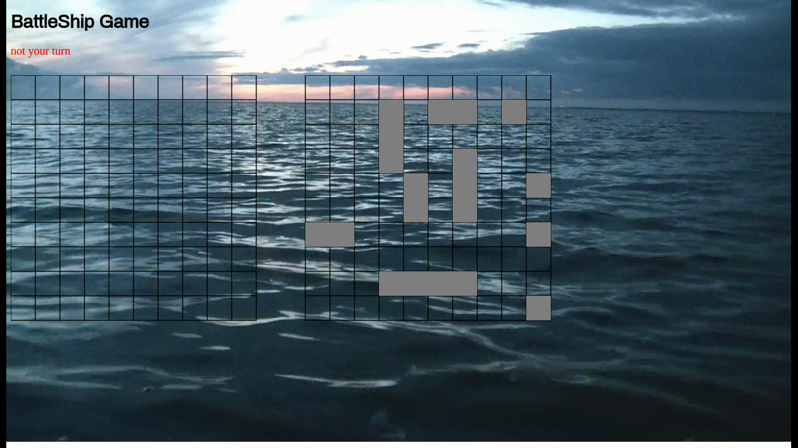

#run command  :npm install , node server.js

# this is a BattleShip game 
##operate the server with the commad of nodemon server.js
##then open 2 tabs in chrome with url of localhost://3333
##put your username in the input field ,click on the login button .
##pick a player from the select list and click on play 
##pick the square in the board that you want to hit .
##green squere will announce for  a hit in the rival board , and red square will announce for miss hit in the rival player

#things you should know :
##the game will be run only with 2 computer that are on the same network - 2 of them wireless or cable

##change your port number here

###have a nice game

